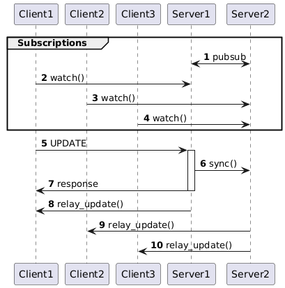

# gostream [](https://codecov.io/gh/lordvidex/gostream)

## Working Principle
<p align="center">
  
</p>

## Motivation
How can we create several different clients that connect to only one server in a cluster but receive updates performed on
any server in the cluster?

## Architecture
gostream has two main components:
- gRPC servers that communicate with one another using redis channels to sync data 
- gRPC clients that connect to ANY of the servers and receive combined updates from all servers.

### Other components
- CLI / TUI interface for client interactions
- CLI for retrieving server status and extra information

## Try it out?
### 0. Dependencies
The servers rely on postgresql and redis to operate. This project contains a simple docker-compose setup.
```bash
cp env.example .env && docker-compose up -d
```
### 1. Creating servers and clients
#### Install CLI tool

```bash
go install github.com/lordvidex/gostream/cmd/gostream@latest
```

#### 
```bash
# Create a new server instance
gostream server serve -c gostream.toml # see ./configs/server.toml for example of server configs

# Create a new client instance with list of server instances that are client-side loadbalanced
gostream client watch -c gostream.toml # see ./configs/client.toml for example of client configs

# Run TUI
gostream client tui -c gostream.toml # see ./configs/client.toml for example of client configs
```
### 2. Configurations
gostream supports configurations from ENV variables, config file and flags. Run `gostream --help` to find out more.

### TUI DEMO


## Things to check out for?
- How long-lived are the connections? Client reconnections when TCP connection gets broken? Can I connect to the same stream for a month+??
- Server stream connection cleanup during disconnect.
- Proper monitoring.
